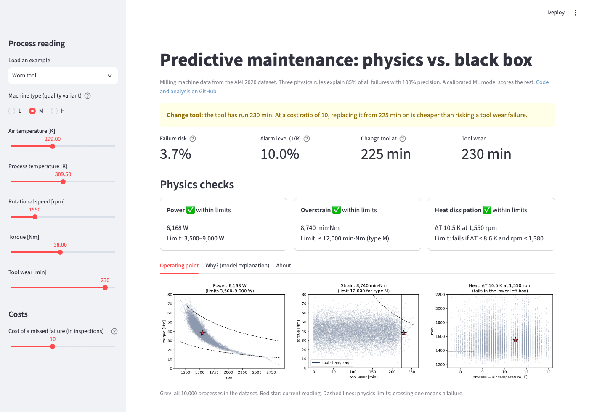

# Worked examples

The app has five built-in examples under **Load an example**. Each one shows a different part of
the decision logic. The links open the [live app][live app] with the example already loaded.
All examples use the default cost ratio R = 10.

## Healthy process

[Open in the app][app-healthy]

| Type | Air | Process | Speed | Torque | Tool wear |
|---|---|---|---|---|---|
| M | 298.5 K | 309.0 K | 1,500 rpm | 40 Nm | 50 min |

**What you see:** a green **Continue**, a failure risk of about 0.1%, and ✅ on all three physics
checks.

**How to read it:** power is 6,283 W, in the middle of the 3.5–9 kW window. Strain is only
2,000 min·Nm because the tool is new. The temperature difference is 10.5 K, well above the
heat dissipation limit. In the SHAP chart, almost every bar is blue: the young tool is the biggest
reason for the low score.

## Power failure (overload)

[Open in the app][app-power]

| Type | Air | Process | Speed | Torque | Tool wear |
|---|---|---|---|---|---|
| L | 300.0 K | 310.5 K | 1,300 rpm | 70 Nm | 30 min |

**What you see:** a red **Stop: failure condition**, *Power limit exceeded*, and a risk of 100%.

**How to read it:** high torque at low speed means high power: 70 Nm × 1,300 rpm ≈ 9,530 W, above
the 9,000 W limit. In the *Operating point* tab, the star sits above the upper dashed curve.

**Try this:** lower the torque slider. The process becomes safe as soon as the power drops below
9,000 W, at about 66 Nm for this speed. Changing the speed works too, but only in one direction: at
constant torque, power grows with speed. Raising the speed makes things worse, while lowering it to
about 1,220 rpm makes the process safe.

## Overstrain

[Open in the app][app-overstrain]

| Type | Air | Process | Speed | Torque | Tool wear |
|---|---|---|---|---|---|
| L | 300.0 K | 310.5 K | 1,450 rpm | 55 Nm | 210 min |

**What you see:** **Stop**, *Overstrain limit exceeded*, 11,550 min·Nm against a limit of 11,000.

**How to read it:** neither value is extreme on its own. 55 Nm is a normal torque and 210 minutes a
normal tool age. Their **product** is too high for a type L machine. In the middle plot, the star is
just past the dashed hyperbola.

**Try this:** switch the machine type to **M**. The limit rises to 12,000 min·Nm, the check turns ✅
and the recommendation changes to **Continue**. The same load is fine for a better machine. Tool wear
of 210 minutes is still below the tool change age of 225.

## Heat dissipation

[Open in the app][app-heat]

| Type | Air | Process | Speed | Torque | Tool wear |
|---|---|---|---|---|---|
| L | 302.5 K | 310.8 K | 1,340 rpm | 45 Nm | 80 min |

**What you see:** **Stop**, *Heat dissipation limit exceeded*: ΔT 8.3 K at 1,340 rpm.

**How to read it:** on a warm day the air is only 8.3 K cooler than the process, and at 1,340 rpm the
spindle is slow. Both conditions together mean the heat cannot get away. In the right-hand plot, the
star sits inside the lower-left box.

**Try this:** raise the speed above 1,380 rpm. The check turns ✅ although the temperatures have not
changed. Heat dissipation only fails when *both* conditions hold.

## Worn tool

[Open in the app][app-worn]

| Type | Air | Process | Speed | Torque | Tool wear |
|---|---|---|---|---|---|
| M | 299.0 K | 309.5 K | 1,550 rpm | 38 Nm | 230 min |

**What you see:** a yellow **Change tool**. All physics checks are ✅ and the failure risk is only
3.7%, below the 10% alarm level.

**How to read it:** this is the most interesting case. Nothing is wrong *right now*, and the model
agrees: the risk is low. But the tool has run 230 minutes. Tool wear failures happen at a random
moment between about 200 and 240 minutes, so an old tool is a gamble. At R = 10, replacing every
tool from 225 minutes on costs less than the breakdowns it prevents. In the SHAP chart, tool wear is
the one big red bar.

**Try this:** move the cost slider.

- At **R = 20** the tool change age drops to 205 minutes.
- At **R = 5** it rises to 246 minutes, and the recommendation turns to **Continue**: when
  breakdowns are cheap, running the tool longer is the better bet.
