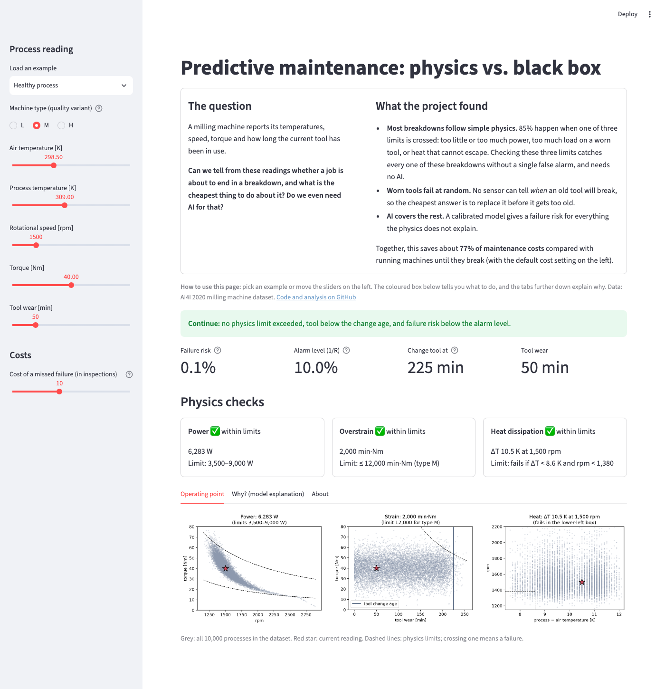
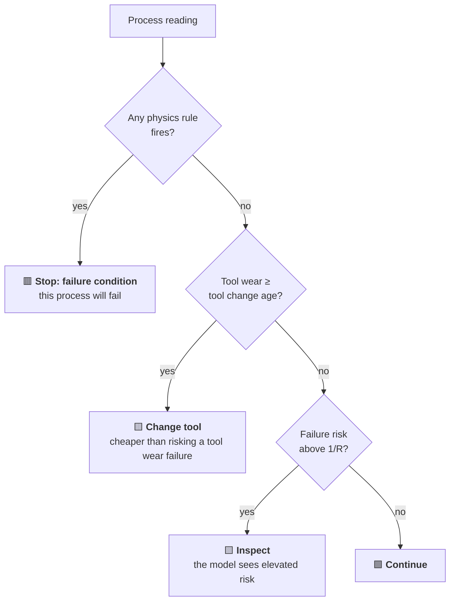
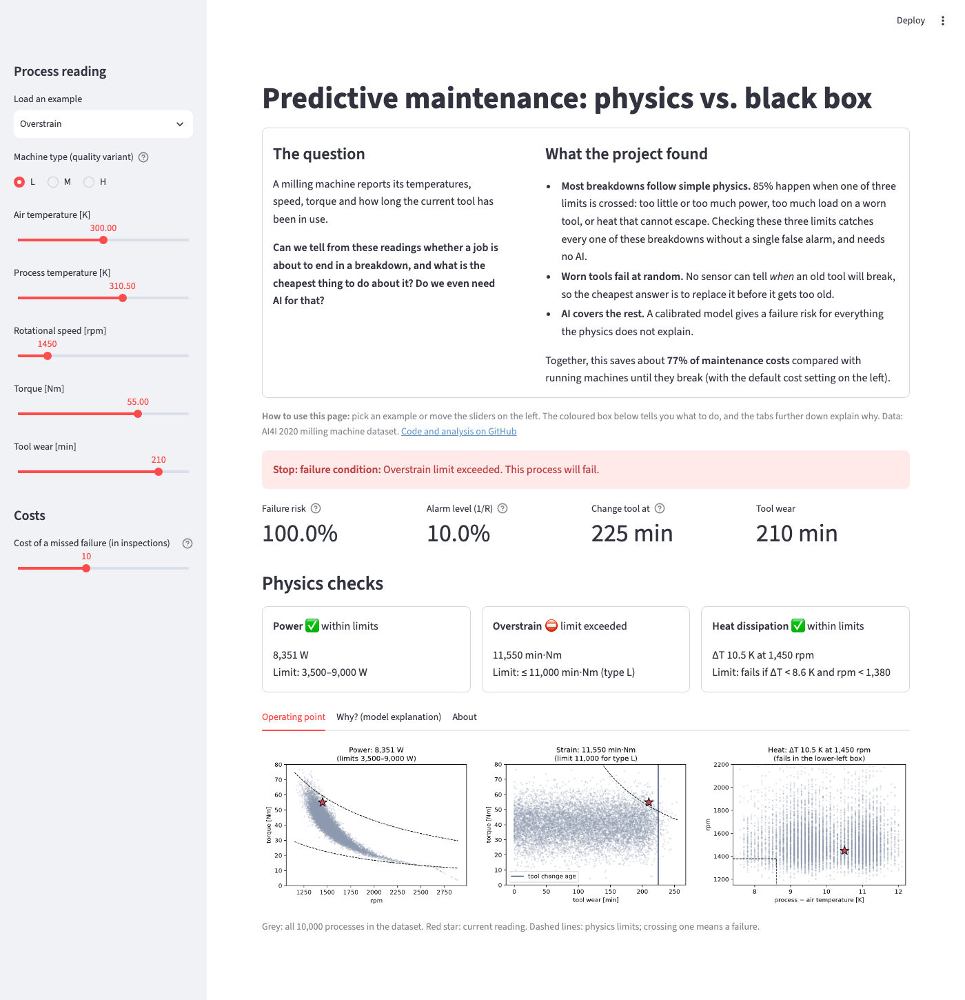
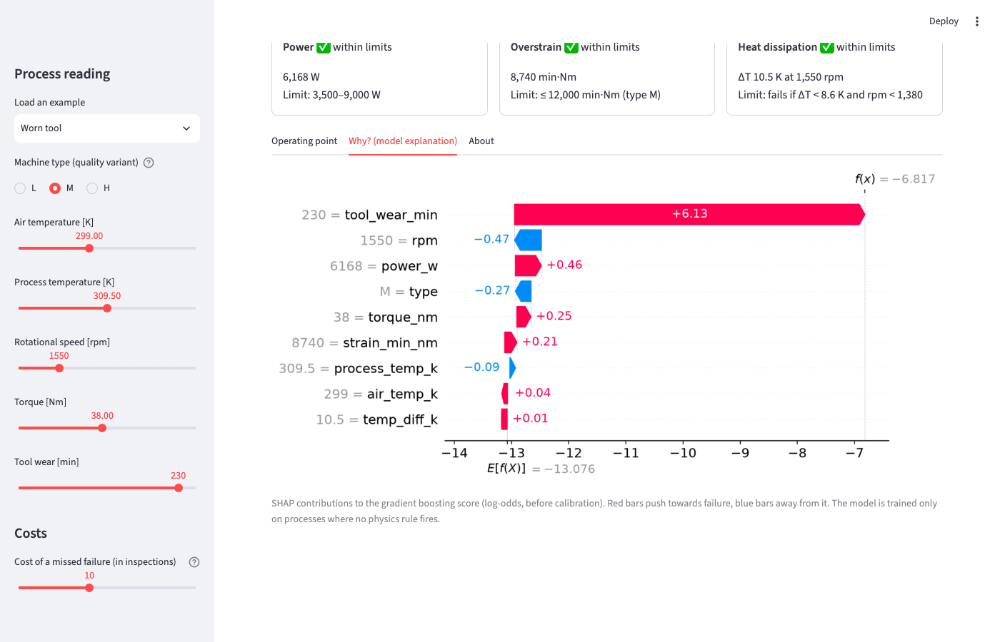

# Reading the app

This page explains every part of the [app][live app]: what you can set, what each number means,
and how to interpret the recommendation.

Below the headline, a short box states **the question behind the project** and **what it found**,
in plain language. It is the one-minute summary of everything on this site. The rest of the screen
has five areas:

| # | Area | What it tells you |
|---|---|---|
| 1 | **Sidebar** (left) | The process reading you are assessing, and how expensive a breakdown is |
| 2 | **Recommendation banner** (coloured box) | What to do now |
| 3 | **Key numbers** | Failure risk, alarm level, tool change age, current tool wear |
| 4 | **Physics checks** | The three physical failure conditions, each with its value and limit |
| 5 | **Detail tabs** | Where the reading sits compared with all data, and why the model scores it the way it does |

!!! tip "First visit"
    The app trains its model when it starts, so the first load can take 20–30 seconds. After that
    every change updates instantly.

## 1. The inputs

A *process* is one machining job on the milling machine. The sliders describe one moment of that
job, as the machine's sensors would report it.

| Input | Unit | Range in the data | What it means |
|---|---|---|---|
| Machine type | L / M / H | 60% / 30% / 10% of processes | Quality variant of the product: low, medium or high. Better variants tolerate more strain. |
| Air temperature | K | 295–305 K (22–31 °C) | Ambient temperature around the machine |
| Process temperature | K | 306–314 K (33–41 °C) | Temperature at the cutting process, always about 10 K above the air |
| Rotational speed | rpm | 1,170–2,890 | Spindle speed |
| Torque | Nm | 4–77 | Load on the spindle |
| Tool wear | min | 0–253 | How long the current tool has been in use |

Temperatures are in kelvin because the dataset uses kelvin. Only the *difference* between the two
temperatures matters for the physics, and a difference of 1 K is the same as 1 °C.

**Load an example** fills in all sliders with a typical case. The [worked examples](examples.md)
page walks through each of them.

### The cost slider

**Cost of a missed failure (in inspections)**, called **R**, is the one business input.
It answers: *how much worse is an unplanned breakdown than a planned stop?*

- An inspection or tool change costs **1**.
- A breakdown that nobody saw coming costs **R**.

The default is **R = 10**. A breakdown (downtime, scrapped part, emergency repair) costs ten
planned stops. R changes two things in the app:

- the **alarm level** for the failure risk, which is 1/R (10% at R = 10)
- the **tool change age**, which moves earlier as breakdowns get more expensive

If you know your plant's real downtime and repair costs, set R to their ratio. The
[decision analysis](../method/decisions.md) shows that the recommendation is stable for any R from 10
upwards.

## 2. The recommendation

The coloured banner gives one of four actions. They are checked in this order, and the first one
that applies wins:

| Action | What it means | How confident is it? |
|---|---|---|
| **Stop: failure condition** | A physical limit is exceeded. In the data, every process in this situation failed. | Very: the rules have 100% precision on all 10,000 processes. |
| **Change tool** | No limit is exceeded, but the tool is old enough that replacing it is cheaper than risking a random tool wear failure. | This is a cost decision, not a prediction. The tool may well have run fine for a while longer. |
| **Inspect** | No rule fires and the tool is young enough, but the model's failure risk is above the alarm level. | Moderate: this is where the uncertain cases are. |
| **Continue** | Nothing indicates a problem. | Most processes. About 15% of all failures carry no warning signal in a single reading, mostly random tool wear failures. The tool change policy prevents part of them. |

This order follows the cheapest policy found in the [cost analysis](../method/decisions.md):
physics rules plus preventive tool changes. The ML risk only adds an alarm on top of that.

## 3. The key numbers

**Failure risk.** The probability that this process ends in a failure, from the calibrated hybrid
model.

- It is **100%** whenever a physics rule fires, because the rules are certain.
- Otherwise it comes from a gradient boosting model trained only on processes where no rule fires.
- The model is **calibrated**: of all processes shown with a risk of about 5%, about 5% actually
  failed. You can read the number literally.
- Most healthy processes show well below 1%. The failure rate in the data is 3.4%, but most of that
  is explained by the rules.

**Alarm level (1/R).** The risk above which an inspection pays off. If the risk is *p*, waiting
costs *p × R* on average and an inspection costs 1, so inspecting is worth it when *p > 1/R*.

**Change tool at.** The tool age from which a preventive tool change is cheaper than the expected
cost of a tool wear failure, for the chosen R. It reads **"not worth it"** when breakdowns are cheap
(R ≤ 2). Replacing tools early would then cost more than the failures it prevents.

**Tool wear.** The current tool age, repeated here for easy comparison with the tool change age.

## 4. The physics checks

Each card shows one physical failure condition, the value of the current reading and the limit.
A ✅ means within limits, a ⛔ means the limit is exceeded and the process will fail.

| Card | Value shown | Formula | Fails when |
|---|---|---|---|
| **Power** | Mechanical power at the spindle | torque × rpm × 2π / 60 | below 3,500 W or above 9,000 W |
| **Overstrain** | Load on a worn tool | tool wear × torque | above 11,000 (L), 12,000 (M) or 13,000 (H) min·Nm |
| **Heat dissipation** | Temperature difference and speed | process − air temperature | ΔT below 8.6 K **and** rpm below 1,380 |

Some things to notice:

- **Power has a window.** Too little power fails as well as too much. In the dataset, the process
  needs between 3.5 and 9 kW.
- **Overstrain depends on the machine type.** The same strain can be fine for a type M machine and
  fatal for type L.
- **Heat dissipation needs both conditions.** A small temperature difference alone is harmless if the
  spindle turns fast enough, because a fast spindle moves more air and removes more heat.

## 5. The detail tabs

### Operating point

Three scatter plots place the current reading (**red star**) among all 10,000 processes in the
dataset (**grey dots**). The **dashed lines** are the physics limits:

- **Power (left):** torque against speed. The two dashed curves are lines of constant power
  (3,500 W and 9,000 W). Between them is safe. The grey cloud shows that speed and torque are
  coupled in normal operation: a fast spindle runs at low torque.
- **Strain (middle):** torque against tool wear. The dashed hyperbola is the overstrain limit for the
  selected machine type; above and to the right of it the tool is overloaded. The **blue vertical
  line** is the tool change age for the chosen R.
- **Heat (right):** speed against the temperature difference. The **lower-left box** (small ΔT and
  slow spindle) is the heat dissipation failure region.

These plots answer "how far am I from a limit?". A star close to a dashed line means a small change
in load could tip the process into failure.

### Why? (model explanation)

This is a **SHAP waterfall chart**. It splits the model's score for this one reading into a
contribution from each feature.

**How to read it:**

1. Start at the bottom: **E[f(X)]** is the model's *average* score over all processes (the base value).
2. Each bar adds or subtracts one feature's contribution:
    - **red bars** push towards failure
    - **blue bars** push away from failure
    - the grey number on the left is the feature's current value, for example `230 = tool_wear_min`
3. At the top, **f(x)** is the final score for this reading. Bars are sorted by size, so the most
   important reasons are at the top.

**The scores are log-odds, not percentages.** A score of −7 corresponds to a very small
probability, and every +1 multiplies the odds of failure by about 2.7. The chart explains the model's
score *before* calibration. Calibration then converts it into the failure risk shown above, for
example −6.8 to 3.7% in the worn tool case. Calibration never changes the direction or the order of
the contributions, only the scale.

**In the example above:** a tool wear of 230 minutes adds +6.1, by far the biggest reason. The
speed (1,550 rpm) and the machine type (M) pull the score down a little. The overall picture is
"healthy process, but an old tool", which matches the *Change tool* recommendation.

!!! warning "When a physics rule fires"
    If a rule fires, the rule decides and the risk is 100%, whatever the chart shows. The ML model
    is trained only on processes where no rule fires, so its explanation is shown for reference only.

!!! info "What SHAP does and does not tell you"
    SHAP explains **what the model does**, not what causes failures in the real machine. It is a
    reliable way to see which inputs drove a prediction. Treat it as a hypothesis generator, which
    is exactly how this project used it to discover the physics rules
    ([explainability](../method/explainability.md)).

### About

A short summary of the project and the decision logic, with a link to the code.

## Frequently asked questions

??? question "Why does the risk jump to 100% when I move one slider a little?"
    You crossed a physics limit. The rules are sharp: at 8,999 W the process is fine, at 9,001 W it
    fails. That is how the dataset was generated, and the [physics page](../method/physics.md) shows
    that the data confirms these limits exactly.

??? question "Why does the app say *Change tool* when the risk is only 3.7%?"
    Because the decision is about **cost**, not only about risk. Tool wear failures happen at a
    random moment between about 200 and 240 minutes of wear. No sensor can predict the exact moment,
    so the model's risk for any single process stays low. Across many processes, though, replacing
    tools at about 225 minutes prevents enough breakdowns to pay for the extra tool changes. The
    [cost analysis](../method/decisions.md#5-why-the-simple-policy-beats-the-ml-model) explains why
    this simple policy beats the model.

??? question "Why doesn't the risk change when I move a slider?"
    Far away from any failure region, all inputs are "normal" and the risk stays near zero. Try
    moving towards a dashed line in the operating point plots; the risk rises as you approach it.

??? question "Why does the tool change age change with the cost slider?"
    The more a breakdown costs, the earlier it pays off to replace the tool: 225 minutes at R = 10,
    about 205 at R = 20, and about 200 at R = 100. For very cheap breakdowns (R ≤ 7) the physics rules
    alone are optimal, and the tool change age moves to the very end of the tool's life. At R = 2 it
    disappears completely.

??? question "Can I trust the app for values at the edge of the sliders?"
    Be careful. The model only knows the ranges seen in the data, and some combinations never occur
    (for example very high torque at very high speed). The physics rules still apply there, but the
    ML risk is an extrapolation. The operating point plots show whether your reading is inside the
    grey cloud.

??? question "Would this work on my machine?"
    Not as-is. The limits are specific to this (synthetic) dataset. The *approach* transfers:
    derive physical quantities, check them against known limits, and use ML only for what physics
    cannot explain. See [what carries over](../results.md#what-carries-over-to-real-machines).
