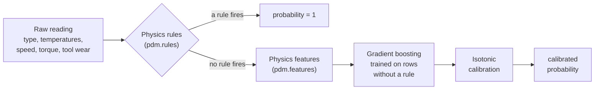

# 6. Engineering

Code: [API reference](../reference/index.md)

The analysis lives in notebooks, but every piece of logic they use lives in a tested Python
package, `pdm`. The notebooks, the training script and the app all import the same code.

## Repository layout

```
├── data/raw/ai4i2020.csv         dataset (CC BY 4.0)
├── notebooks/01…05_*.ipynb       the analysis, one notebook per step
├── src/pdm/                      the Python package
├── app/streamlit_app.py          the demo app
├── tests/                        unit and app tests
├── reports/                      figures, metrics.json, CV results
├── docs/ + mkdocs.yml            this documentation
└── .github/workflows/            CI
```

## The package

| Module | Responsibility |
|---|---|
| [`pdm.data`](../reference/data.md) | Load the CSV with clean column names and types |
| [`pdm.features`](../reference/features.md) | Physics features: temperature difference, power, strain |
| [`pdm.rules`](../reference/rules.md) | The three rules as sklearn classifiers, and the rules-then-model hybrid |
| [`pdm.models`](../reference/models.md) | Model pipelines and the final `hybrid_model()` |
| [`pdm.evaluate`](../reference/evaluate.md) | Cross-validation, out-of-fold predictions, metrics |
| [`pdm.explain`](../reference/explain.md) | SHAP values in raw feature units |
| [`pdm.cost`](../reference/cost.md) | Cost curves, cross-validated threshold choice, tool change policy |
| [`pdm.decision`](../reference/decision.md) | Turn one reading into a recommended action |
| [`pdm.train`](../reference/train.md) | Training CLI: `uv run pdm-train` |

## The final model



`hybrid_model()` returns this as a single scikit-learn estimator, so it works with
`cross_val_predict`, `clone` and `joblib` like any other model:

```python
from pdm.data import FEATURES, TARGET, load_data
from pdm.models import hybrid_model

df = load_data()
model = hybrid_model().fit(df[FEATURES], df[TARGET])
model.predict_proba(df[FEATURES].head())[:, 1]
```

## Testing

37 tests in `tests/` cover:

- **data:** schema and types of the loaded dataset
- **rules:** each rule reproduces its failure-mode label on all 10,000 rows
- **evaluation:** the best-F1 threshold, checked against brute force (the original bug)
- **explanations:** SHAP values add up exactly to the model output, also through calibration
- **cost:** cost curves checked against brute force, cross-validated threshold selection
- **training:** the CLI writes a loadable model and a complete metrics file
- **app:** Streamlit's `AppTest` runs the app headless and checks the recommendation for every preset

## Continuous integration

Every push runs two GitHub Actions jobs:

1. **Lint and test:** `ruff check`, `ruff format --check`, the full test suite, and a check that
   `requirements.txt` matches `uv.lock`.
2. **Execute notebooks:** all five notebooks run from top to bottom, so no analysis can silently break.

The documentation is built with `mkdocs build --strict` and published to GitHub Pages.

## The app

The Streamlit app trains the final model once at startup (`st.cache_resource`) instead of loading a
pickled file. The dataset is small, and this avoids version mismatches between the training and
serving environments. All decision logic is in `pdm.decision`, so the app itself only handles layout.
A `?preset=` URL parameter opens the app with an example loaded.

## Tooling

| Tool | Purpose |
|---|---|
| [uv](https://docs.astral.sh/uv/) | Python 3.12, dependencies and lockfile |
| [ruff](https://docs.astral.sh/ruff/) | Linting and formatting |
| [pytest](https://pytest.org) | Tests |
| [scikit-learn](https://scikit-learn.org), [SHAP](https://shap.readthedocs.io) | Models and explanations |
| [Streamlit](https://streamlit.io) | Demo app |
| [MkDocs Material](https://squidfunk.github.io/mkdocs-material/), [mkdocstrings](https://mkdocstrings.github.io) | This documentation |
