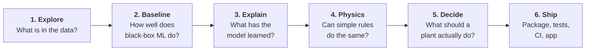

# How it was built

The project went through six steps. Each one has a notebook in the [repository][notebooks], and
each step raised the question that the next one answered.

| Step | Question | Answer | Notebook |
|---|---|---|---|
| [1. Data exploration](data.md) | What does the data look like? | 10,000 independent processes, 3.4% failures, five failure modes. Single sensors separate failures poorly; combinations separate them well. | [01_eda][nb01] |
| [2. Baseline models](baseline.md) | How good is standard ML? | Gradient boosting: PR-AUC 0.835, F1 0.78. Linear models fail. Tool wear failures are mostly missed. | [02_baseline_models][nb02] |
| [3. Explainability](explainability.md) | What did the model learn? | SHAP reveals three sharp failure regions, each a combination of two sensors. They become three testable hypotheses. | [03_explainability][nb03] |
| [4. Physics features and rules](physics.md) | Does physics beat the black box? | Yes. Three rules reproduce their failure labels on all 10,000 rows and reach F1 0.92 with 100% precision. That is also the ceiling. | [04_physics_features][nb04] |
| [5. From predictions to decisions](decisions.md) | What is cheapest in practice? | Physics rules plus preventive tool changes: about 77% savings at R = 10, better than any ML policy. | [05_cost_threshold][nb05] |
| [6. Engineering](engineering.md) | How is it built and tested? | A tested Python package, a training CLI, CI that runs every notebook, and the Streamlit app. | — |

## Principles used throughout

**Honest evaluation.** Every number comes from stratified 5-fold cross-validation with the same
splits for every approach. Thresholds are chosen on training folds only. Explanations of single
predictions use the fold model that never saw the row.

**Metrics that fit the problem.** Failures are rare, so accuracy is meaningless: always predicting
"no failure" is already 96.6% accurate. The analysis uses PR-AUC and F1 on the failure class, and
finally **expected cost**, which is what a plant actually cares about.

**Check every claim.** Each interpretation in the notebooks was checked against the numbers.
Several were corrected along the way, and the notebooks keep the instructive mistakes as
"lessons learned".
